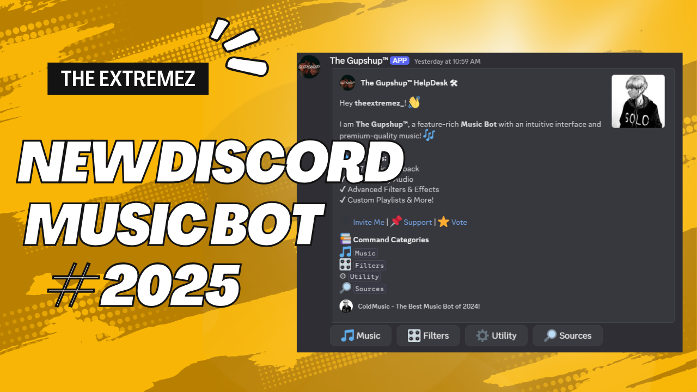

# 🎶 Ultimate Discord Music Bot 🚀



A **powerful, aesthetic, and feature-rich** Discord music bot designed for the ultimate listening experience! Enjoy seamless playback, high-quality audio, and a sleek modern UI. 🎧

## 🌟 Features
✅ **High-Quality Music Playback** (Lavalink Powered)  
✅ **Supports YouTube, Spotify, SoundCloud & More**  
✅ **Custom Playlists & Queue Controls**  
✅ **24/7 Mode for Uninterrupted Streaming**  
✅ **Loop, Skip, Shuffle, and Volume Controls**  
✅ **Interactive Buttons & Modern UI**  
✅ **Lightning-Fast Performance & Stability**  

---

## 🚀 Installation & Setup

### 1️⃣ Clone the Repository
```bash
git clone https://github.com/your-username/discord-music-bot.git
cd discord-music-bot
```

### 2️⃣ Install Dependencies
```bash
npm install
```

### 3️⃣ Configure the Bot
Create a `.env` file and add your **Discord Bot Token** and other details:
```env
TOKEN=YOUR_DISCORD_BOT_TOKEN
GUILD_ID=YOUR_SERVER_ID
CLIENT_ID=YOUR_CLIENT_ID
```

### 4️⃣ Start the Bot
```bash
npm start
```
> 🎉 Your bot is now online and ready to play music!

---

## 🎮 Commands
📌 **Music Controls:** `!play`, `!pause`, `!resume`, `!stop`, `!skip`, `!loop`  
📌 **Queue Management:** `!queue`, `!remove`, `!clear`  
📌 **Advanced Features:** `!volume`, `!lyrics`, `!radio`, `!stream`  

🔗 **More Commands & Help:** Use `!help` in Discord! 

---

## 📸 Screenshots

> *A sleek, modern, and interactive UI for the best experience!*

---

## 🛠 Technologies Used
- **Node.js** & **Discord.js** 📜
- **Kazagumo (Lavalink Wrapper)** 🎵
- **MongoDB for Data Storage** 📁
- **Cluster & Sharding Support** 🔥

---

## 🤝 Contribute
Got cool ideas? PRs are welcome! Fork the repo & submit improvements. 💡

```bash
git fork https://github.com/your-username/discord-music-bot.git
```

---

## 📌 Links
🔹 **Invite the Bot:** [Click Here](https://discord.com/oauth2/authorize?client_id=YOUR_CLIENT_ID&scope=bot&permissions=8)  
🔹 **Join Our Discord:** [Discord Server](https://discord.gg/cGJ4r9Ye4q)  
🔹 **Website:** [Extremez](https://extremez.vercel.app)  

---

## ❤️ Support & Credits
💙 Developed by **[Your Name]**  
📌 If you love this bot, consider ⭐ starring the repo!

**🚀 Level up your Discord server’s music experience today!**
